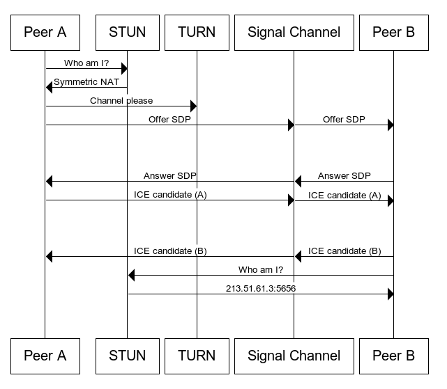
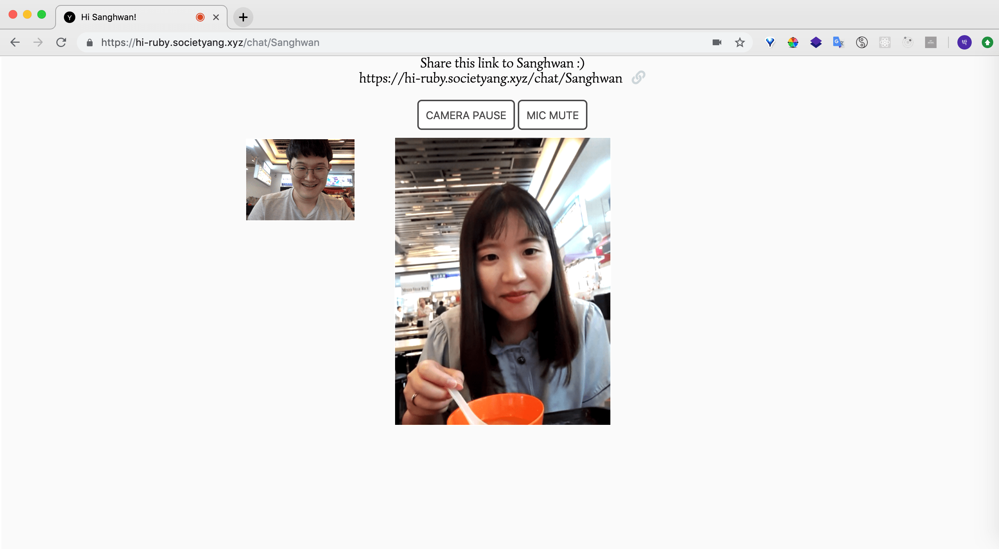

# hi-ruby
This website was created to make video calls. It was created using WebRTC, an API that enables p2p communication.

## Site
[https://hi-ruby.societyang.xyz](https://hi-ruby.societyang.xyz)

## Libraries / Tools
Node.js, TypeScript, WebRTC, Sentry

## Reference
- WebRTC Tutorial
[https://www.html5rocks.com/ko/tutorials/webrtc/basics/](https://www.html5rocks.com/ko/tutorials/webrtc/basics/)

- STUN, TURN, ICE
[https://m.blog.naver.com/itperson/220952200651](https://m.blog.naver.com/itperson/220952200651)